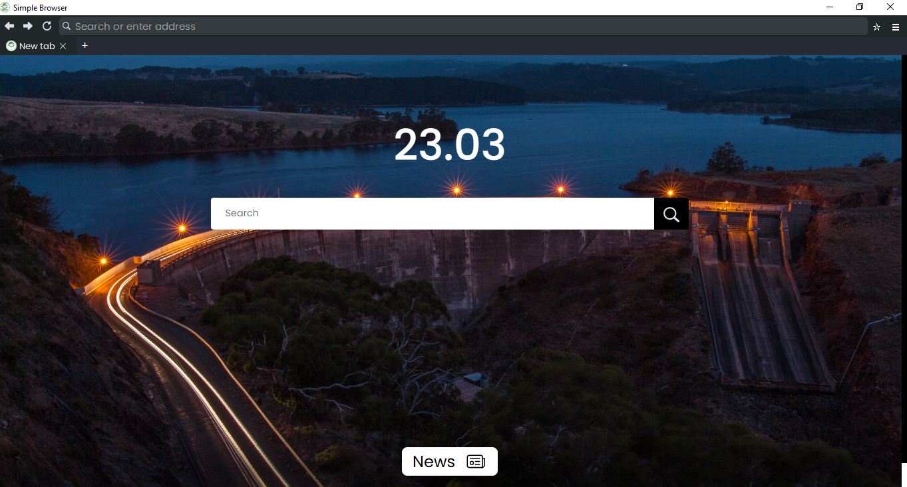

# Simple Browser 🌐

  

 

Welcome to **Simple Browser**! 👋 

This is a lightweight, minimal, and modern web browser built entirely with [Python](https://www.python.org/) and [PyQt6](https://www.riverbankcomputing.com/software/pyqt), powered by the robust Chromium engine under the hood.

> [!WARNING]
> **🚧 Work in Progress**
> Let's be real—this project is still in its early development phases. It’s not quite ready to completely replace your daily driver (like Chrome, Edge, or Firefox) just yet, and you might still encounter a few rough edges. However, it's constantly improving and highly usable!

## ✨ Why Simple Browser? (The Good Stuff)

Even though we are still growing, Simple Browser already packs some seriously advanced features designed to keep your browsing fast and your RAM usage incredibly low:

- **😴 Smart Sleeping Tabs:** Modern browsers are notorious memory hogs. Simple Browser fixes this by automatically putting tabs to "sleep" after 5 minutes of inactivity. It aggressively frees up your RAM, but don't worry—your back/forward history is perfectly preserved when you wake the tab back up!
- **🛡️ Built-in Ad & Tracker Blocker:** We intercept and block common ads and trackers right at the network level. This means cleaner web pages, more privacy, and significantly faster loading times.
- **⚡ Disk Caching:** We cache heavy assets locally so your favorite websites load blazingly fast on your next visit.
- **🎨 Minimalist UI:** No clutter, just the web. A clean, distraction-free interface built for focus.

## 📸 Sneak Peek

## 🤝 Contributing

We would absolutely love your help to make Simple Browser even better! Whether you want to fix a bug, add a missing standard feature, or just clean up some code, feel free to open a Pull Request. We review contributions as quickly as possible.

Let's build a cool Python browser together! 🚀